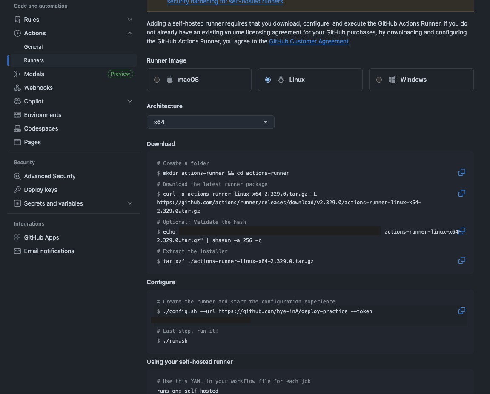

## 1. GitHub Actions Self-Hosted Runner 구축
self-hosted Runner의 호스트를 'aws ec2 프리티어 인스턴스'로 ? 

가본적으로 아웃바운드로 작동

~~~yaml
runs-on: self-hosted 
~~~
- 역할 : 적업 실행 환경 
- 위치 : 당신의 EC2
- 목적 : Github Actions 작업을 EC2에서 실행

현재 ec2 내부 상태

---
전체 단계 요약 리스트
- [x] EC2 인스턴스 생성 및 Docker, Java, git 설치
- [x] EC2 인스턴스 내 GitHub Actions Runner 다운로드
- [x] Runner 등록 및 서비스 시작
- [ ] 테스트 워크플로우 실행
- [ ] CI/CD 파이프라인 구축
---


## EC2에 Runner 설치 및 실행
Github Repository 페이지 → "Setting" -> "Actions" -> "Runners"에서 Download 명령어 사용

~~~bash
# Create a folder
$ mkdir actions-runner && cd actions-runnerCopied!
# Download the latest runner package
$ curl -o actions-runner-linux-x64-2.329.0.tar.gz -L 
https://github.com/actions/runner/releases/download/v2.329.0/actions-runner-linux-x64-2.329.0.tar.gzCopied! 
# Optional: Validate the hash
$ echo "                            actions-runner-linux-x64-2.329.0.tar.gz" | shasum -a 256 -cCopied! 
# Extract the installer
$ tar xzf ./actions-runner-linux-x64-2.329.0.tar.gz
~~~
Github 이랑 연결 
~~~bash
# Create the runner and start the configuration experience
$ ./config.sh --url https://github.com/hye-inA/deploy-practice --token                    Copied! 

# Last step, run it!
$ ./run.sh
~~~




### Runner를 서비스로 실행
~~~
sudo ./svc.sh install
~~~


~~~
sudo ./svc.sh start
sudo ./svc.sh status
~~~


### GitHub에서 확인


## Workflow 작성

### 테스트 워크플로우 생성

프로젝트 내부에서 `.github/workflows/test-runner.yml` 파일 생성

```yaml
name: Test Self-Hosted Runner

# github actions 트리거 -> 'on: push:' 조건 만족
on:
  push:
    branches: [ main ]
  workflow_dispatch:  # 수동 실행 가능

# Runner 할당 -> 'runs-on: self-hosted' 찾기
jobs:
  test:
    runs-on: self-hosted
    
    steps:
    - name: Checkout code
      uses: actions/checkout@v3
    
    - name: Print system info
      run: |
        echo "Runner 정보"
        echo "Hostname: $(hostname)"
        echo "OS: $(uname -a)"
        echo "CPU: $(nproc) cores"
        echo "Memory: $(free -h | grep Mem | awk '{print $2}')"
        echo "Disk: $(df -h / | tail -1 | awk '{print $4}') available"
    
    - name: Check Java version
      run: java -version
    
    - name: Check Docker version
      run: docker --version
    
    - name: List files
      run: |
        echo "Working directory:"
        pwd
        ls -la
```

### GitHub에 push 후 Actions에서 확인


### EC2에서 로그 확인
~~~bash
# EC2에서 실행
sudo journalctl -u actions.runner.* -f
~~~


### 정리
1. **Workflow 작성** → `.github/workflows/test-runner.yml`
2. **Git push** → GitHub에 코드 업로드
3. **GitHub Actions 트리거** → `on: push:` 조건 만족
4. **Runner 할당** → `runs-on: self-hosted` 찾기
5. **EC2에서 실행** → Runner가 작업 받아서 실행
6. **결과 리포트** → GitHub UI에서 확인 가능

Runner는 "작업 실행 환경"일 뿐입니다.
CI를 할지, CD를 할지는 Workflow 파일에 달려있음
---

## CI/CD 워크플로우 구축

Spring Boot 프로젝트의 CI/CD를 구축

### Gradle 빌드 워크플로우

`.github/workflows/ci-cd.yml`

```yaml
name: CI/CD Pipeline

on:
  push:
    branches: [ main ]
  pull_request:
    branches: [ main ]

env:
  DOCKER_IMAGE: ${{ secrets.DOCKER_USERNAME }}/spring-boot-app

jobs:
  build:
    runs-on: self-hosted
    
    steps:
    - name: Checkout code
      uses: actions/checkout@v3
    
    - name: Set up JDK 21
      uses: actions/setup-java@v3
      with:
        java-version: '21'
        distribution: 'temurin'
        cache: gradle
    
    - name: Grant execute permission
      run: chmod +x ./gradlew
    
    - name: Build with Gradle
      run: ./gradlew clean build -x test
    
    - name: Run tests
      run: ./gradlew test
```

### Docker Hub 설정

**GitHub Secrets 추가:**

Repository → Settings → Secrets and variables → Actions → New repository secret 생성

- Name: DOCKER_USERNAME
<br>Secret: dockerhub-username 
- Name: DOCKER_PASSWORD
<br>Secret: dockerhub-password


### Dockerfile 작성

프로젝트 루트에 `Dockerfile`:

```dockerfile
FROM eclipse-temurin:17-jre-alpine

WORKDIR /app

COPY build/libs/*.jar app.jar

EXPOSE 8080

ENTRYPOINT ["java", "-Xmx256m", "-jar", "app.jar"]
```

### Runner가 작업을 받지 못하는 경우

```bash
# Workflow 파일 확인
# runs-on: self-hosted ← 이게 맞는지 확인

# GitHub에서 Runner 라벨 확인
# Settings → Actions → Runners
# 표시된 라벨: self-hosted, Linux, X64
```
---
## 참고 ) 서비스 관리 명령어

```bash
# Runner 상태 확인
sudo ./svc.sh status

# 로그 확인
sudo journalctl -u actions.runner.* --no-pager -n 50

# Runner 시작
sudo ./svc.sh start

# Runner 중지
sudo ./svc.sh stop

# Runner 재시작
sudo ./svc.sh restart

# 서비스 제거 (Runner 등록은 유지)
sudo ./svc.sh uninstall

# Runner 완전 제거 (재등록 필요)
cd ~/actions-runner
sudo ./svc.sh stop
sudo ./svc.sh uninstall
./config.sh remove
```

# 전체 흐름
~~~mermaid
flowchart TD

A[1. 로컬 PC<br>git push origin main]
A--> B[2. GitHub Repository<br>코드 저장<br>workflows/test-runner.yml 파일 감지]

B --> C[3. GitHub Actions 서비스<br>workflow 파일 읽기<br>self hosted Runner 확인<br>Runner탐색]

C --> D[4. EC2 Self Hosted Runner<br>actions runner 동작<br>GitHub API 폴링<br>작업 수신 후 실행]

D --> E[5. EC2 작업 실행<br>Set up job<br>Checkout code<br>Workflow steps 실행<br>Cleanup]

E --> F[6. GitHub Actions UI<br>실행 결과 표시<br>로그 저장<br>웹에서 확인]
~~~
